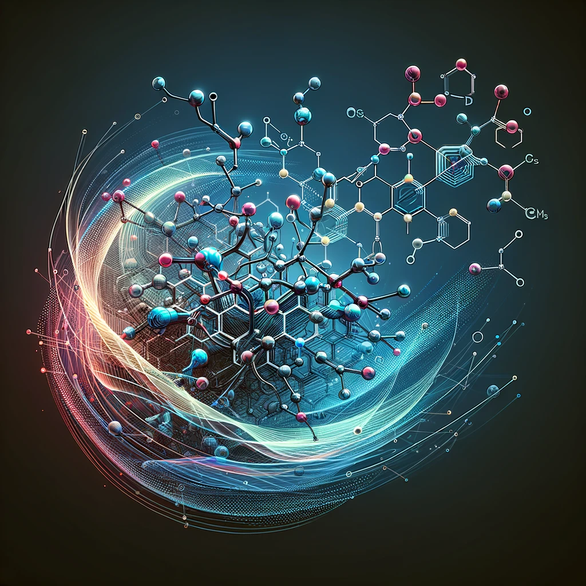

# KGGraph


## Objective
KGGraph aims to innovate in integrating chemical knowledge into graph representations, utilizing substructure graphs to develop graph neural network models for predicting molecular properties.



## Overview
KGGraph is a cutting-edge toolkit designed for scientists and researchers in computational chemistry and molecular modeling. It leverages graph neural networks to transform chemical substructures into predictive models, enhancing the accuracy and efficiency of molecular property prediction.

## Key Features

- **Chemical Knowledge Integration**: Integrate detailed chemical knowledge into graph representations, enhancing model accuracy and interpretability.
- **Substructure Graph Utilization**: Utilize substructure graphs to capture the intricate details of molecular structures, providing a robust foundation for graph neural network models.
- **Molecular Property Prediction**: Develop predictive models for various molecular properties, leveraging the power of graph neural networks.

## Installation

1. **Creating a Virtual Environment (Optional but Recommended):**
It's recommended to use a virtual environment to avoid conflicts with other projects or system-wide packages. Use the following commands to create and activate a virtual environment:

```bash
python -m venv kggraph-env
source kggraph-env/bin/activate  # On Windows use `synrbl-env\Scripts\activate`
```
Or Conda

```bash
conda create --name kggraph-env python=3.11
conda activate kggraph-env
  ```
2. **Cloning and Installing KGGraph:**

Clone the KGGraph repository and install it using the `setup.py` file:

```bash
git clone https://github.com/yourusername/KGGraph.git
cd KGGraph
python setup.py install
```

## Usage
TODO

## Contributing
Contributions to MotifGraph are welcome! Please refer to the contribution guidelines for more information.

## License
MotifGraph is released under the MIT License.

## Contact
For questions or support, contact us at tvthinh.d19@ump.edu.vn.